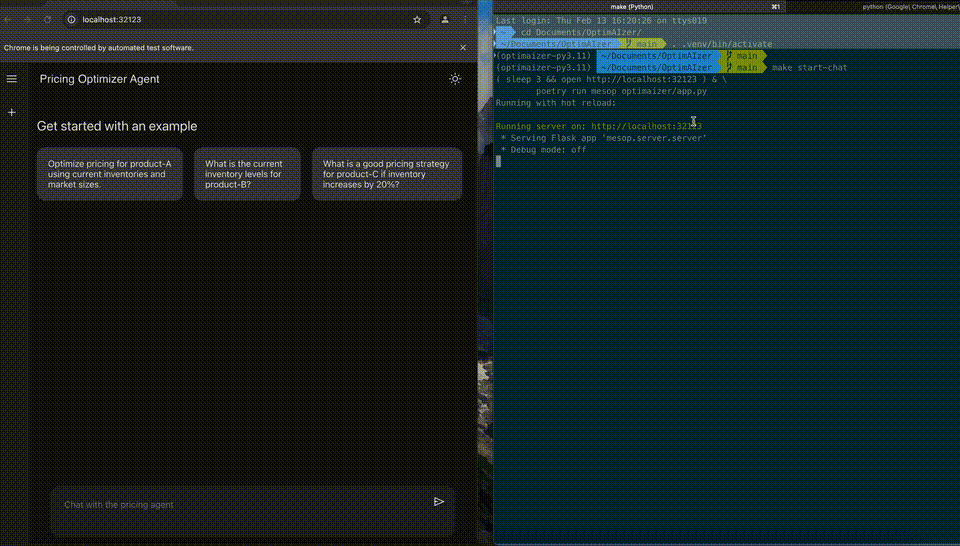

# OptimAIzer

## Overview
OptimAIzer is a side project that integrates a Large Language Model (LLM) with a simple Operations Research (OR) model to explore AI-driven pricing optimization. The goal is to create an agentic system that interacts with an optimization model through natural language, enabling dynamic pricing adjustments based on constraints and business inputs.

## Tech Stack
- **LLM:** OpenAI 4o-mini with function calling
- **OR Model:** [OR-Tools](https://developers.google.com/optimization)
- **UI:** [Mesop](https://google.github.io/mesop/)
- **Automation:** [Selenium](https://www.selenium.dev/) (used for scripted interactions and demos)

## Features
OptimAIzer provides an interactive AI agent that can:

1. **Retrieve default data**
   - Fetch information on supported products, current inventory levels, market size, and other relevant parameters.

2. **Execute an OR model for optimal pricing**
   - Compute optimal pricing based on input parameters.
   - Inject custom constraints that are executed dynamically at runtime.

3. **Inspect OR model formulation**
   - Retrieve the source code of the OR model. Which helps the LLM understand the model syntax for injecting constraints correctly.

## Interaction Flow
1. The LLM receives a user query.
2. If a function is required, we execute it on behalf of the LLM.
3. Results are returned to the LLM (or an error if any).
4. If no additional action is required, the LLM returns an answer to the user for further interaction.

## UI & Automation
- A **Mesop-based chat UI** enables easy interaction with the agent.
- A **Selenium demo script** automates predefined interactions, showcasing the agent’s capabilities.

## Demo
🎥 Full demo on [YouTube](https://www.youtube.com/watch?v=Kboo2NDUgcY)

